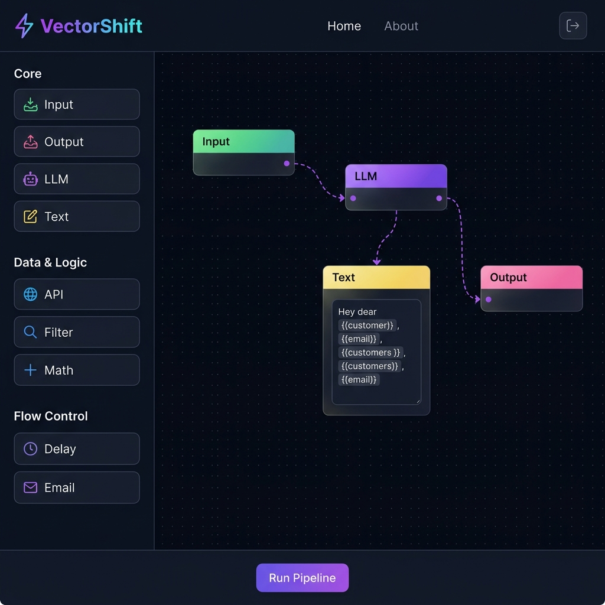
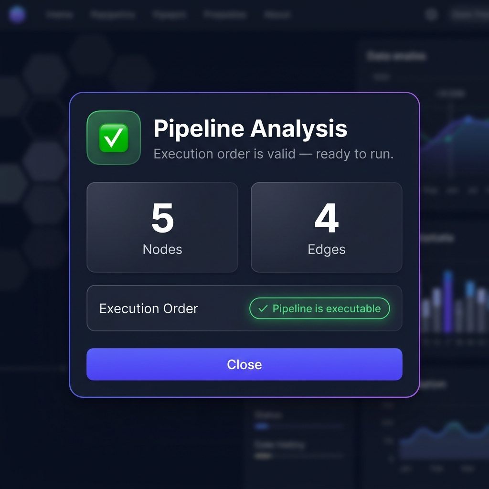

<div align="center">

# ⚡ VectorShift Pipeline Editor

**A production-quality visual AI pipeline editor — built for the VectorShift Frontend Technical Assessment**

[](https://reactjs.org/)
[](https://reactflow.dev/)
[](https://fastapi.tiangolo.com/)
[](https://python.org/)
[](https://networkx.org/)
[](https://zustand-demo.pmnd.rs/)

*Drag. Connect. Analyse. Ship.*

</div>

---

## 📸 Screenshots

### Editor Canvas


### Pipeline Analysis Modal


---

## 🚀 Quick Start

### Prerequisites
- **Node.js** ≥ 16
- **Python** ≥ 3.9
- **pip**

### 1 — Frontend

```bash
cd frontend
npm install
npm start
# → http://localhost:3000
```

### 2 — Backend

```bash
cd backend
pip install -r requirements.txt
uvicorn main:app --reload
# → http://localhost:8000
```

> Both servers must be running simultaneously to use the **Run Pipeline** button.

---

## 🧩 Assessment Parts

### Part 1 — Node Abstraction

The core engineering challenge: eliminate all duplicated node code via a single config-driven `BaseNode` component.

#### Architecture

Every node is defined purely as a **config object** — no duplicated JSX, no copy-pasting:

```jsx
// Creating a brand-new node takes ~40 lines of config, zero boilerplate
const MY_NODE_CONFIG = {
  title:   'API Request',
  icon:    '🌐',
  color:   'linear-gradient(135deg, #0F2027, #2C5364)',
  inputs:  [{ id: 'body',     label: 'body'     },
            { id: 'headers',  label: 'headers'  }],
  outputs: [{ id: 'response', label: 'response' },
            { id: 'status',   label: 'status'   }],
  fields:  [
    { type: 'text',   name: 'url',    label: 'URL',    placeholder: 'https://...' },
    { type: 'select', name: 'method', label: 'Method', options: ['GET','POST','PUT','DELETE'] },
  ],
};

export const APINode = ({ id, data }) => (
  <BaseNode id={id} data={data} config={MY_NODE_CONFIG} onFieldChange={...} />
);
```

#### BaseNode Field Types

| Type | Renders | Use case |
|------|---------|----------|
| `text` | `<input type="text">` | Names, URLs, keys |
| `number` | `<input type="number">` | Durations, operands |
| `select` | `<select>` with options | Enums, types |
| `textarea` | `<textarea>` | Multi-line content |
| `readonly` | Static display | Info labels |

#### All 9 Node Types

| Node | Icon | Inputs | Outputs | Fields |
|------|------|--------|---------|--------|
| **Input** | 📥 | — | value | Name, Type |
| **Output** | 📤 | value | — | Name, Type |
| **LLM** | 🤖 | system, prompt | response | Model (readonly) |
| **Text** | 📝 | *(dynamic via variables)* | output | Text (auto-resize) |
| **API** | 🌐 | body, headers | response, status | URL, Method, Content-Type |
| **Filter** | 🔍 | data | pass, reject | Field, Operator, Value |
| **Math** | ➕ | A, B | result | Operation, Constant B |
| **Delay** | ⏱️ | trigger | done | Duration, Unit |
| **Email** | ✉️ | body, trigger | sent | To, Subject, Priority |

---

### Part 2 — Styling

A complete dark glassmorphism design system built from scratch in `index.css` — no Tailwind, no UI library.

#### Design Tokens

```css
:root {
  --bg-canvas:     #0a0d14;   /* deep space dark */
  --bg-surface:    #111827;   /* sidebar/header  */
  --bg-card:       #1a2235;   /* node background */
  --accent-purple: #8b5cf6;   /* primary accent  */
  --accent-blue:   #3b82f6;   /* target handles  */
  --accent-green:  #10b981;   /* source handles  */
}
```

#### UI Features

- 🎨 **Gradient node headers** — each node type has a unique colour identity
- 🪟 **Glassmorphism cards** — `rgba` backgrounds with subtle borders
- ✨ **Node lift on hover** — `translateY(-2px)` with purple glow shadow
- 🌊 **Animated flowing edges** — CSS `stroke-dasharray` creates a live data-flow feel
- 🔵 **Handle colour coding** — blue targets (inputs), green sources (outputs)
- 📍 **Empty canvas hint** — floating animated prompt when canvas is blank
- 🗺️ **Themed minimap** — each node type coloured by its identity
- 🔡 **Inter font** — Google Fonts, loaded via `@import`
- ⚡ **Node entry animation** — spring-in pop when a node is dropped

---

### Part 3 — Text Node Logic

The `TextNode` has two advanced behaviours built on top of `BaseNode`.

#### Auto-Resize

The node width and height grow with the content:

```js
// Height: textarea expands to fit scrollHeight
ta.style.height = 'auto';
ta.style.height = `${ta.scrollHeight}px`;

// Width: estimated from the longest line × 8px per char
const longestLine = text.split('\n').reduce((a, b) => a.length > b.length ? a : b, '');
const width = Math.max(220, longestLine.length * 8 + 60);
```

#### Dynamic Variable Handles

Typing `{{variableName}}` anywhere in the text field instantly creates a left-side Handle:

```js
const VAR_REGEX = /{{\s*([a-zA-Z_$][a-zA-Z0-9_$]*)\s*}}/g;

const extractVariables = (text) => {
  const matches = [...text.matchAll(VAR_REGEX)];
  return [...new Set(matches.map(m => m[1]))]; // unique names only
};
```

**Example input:**
```
Hello {{customer}}, your score is {{score}}. Account: {{account}}.
```

**Result:** Three left-side handles appear — `customer`, `score`, `account` — evenly spaced and labelled. Removing a variable from the text removes its handle immediately.

---

### Part 4 — Backend Integration

#### Frontend (`submit.js`)

Reads the live Zustand store and sends nodes + edges to the backend:

```js
const response = await fetch('http://localhost:8000/pipelines/parse', {
  method: 'POST',
  headers: { 'Content-Type': 'application/json' },
  body: JSON.stringify({ nodes, edges }),
});
const data = await response.json();
// → { num_nodes, num_edges, is_dag }
```

Shows a **loading spinner** while waiting, then a **styled modal** with the results.

#### Backend (`main.py`)

```python
import networkx as nx
from fastapi.middleware.cors import CORSMiddleware

@app.post("/pipelines/parse")
def parse_pipeline(pipeline: PipelineRequest):
    G = nx.DiGraph()
    for node in pipeline.nodes:
        G.add_node(node["id"])
    for edge in pipeline.edges:
        G.add_edge(edge["source"], edge["target"])

    return {
        "num_nodes": len(pipeline.nodes),
        "num_edges": len(pipeline.edges),
        "is_dag":    nx.is_directed_acyclic_graph(G),
    }
```

CORS is enabled for `http://localhost:3000`.

#### Result Modal

| State | Icon | Badge | Subtitle |
|-------|------|-------|----------|
| Valid DAG | ✅ | 🟢 Pipeline is executable | Execution order is valid — ready to run. |
| Has cycles | ⚠️ | 🔴 Cycle detected | Pipeline contains a cycle — fix connections to enable execution. |

---

## 🏗️ Project Architecture

```
frontend_technical_assessment/
│
├── frontend/
│   ├── src/
│   │   ├── nodes/
│   │   │   ├── BaseNode.js        ← ⭐ Config-driven base (the core abstraction)
│   │   │   ├── inputNode.js       ← Refactored: uses BaseNode
│   │   │   ├── outputNode.js      ← Refactored: uses BaseNode
│   │   │   ├── llmNode.js         ← Refactored: uses BaseNode
│   │   │   ├── textNode.js        ← Custom: auto-resize + variable handles
│   │   │   ├── apiNode.js         ← New: HTTP request node
│   │   │   ├── filterNode.js      ← New: conditional routing node
│   │   │   ├── mathNode.js        ← New: arithmetic node
│   │   │   ├── delayNode.js       ← New: wait/delay node
│   │   │   └── emailNode.js       ← New: email notification node
│   │   │
│   │   ├── App.js                 ← Layout: header + sidebar + canvas + footer
│   │   ├── ui.js                  ← ReactFlow canvas, all 9 node types registered
│   │   ├── toolbar.js             ← Categorised node palette sidebar
│   │   ├── draggableNode.js       ← Drag chip with icon + colour support
│   │   ├── submit.js              ← Submit button + result modal
│   │   ├── store.js               ← Zustand store (nodes, edges, actions)
│   │   └── index.css              ← Full design system (CSS variables + animations)
│   │
│   ├── docs/
│   │   ├── editor_screenshot.png
│   │   └── dag_modal_screenshot.png
│   └── package.json
│
└── backend/
    ├── main.py                    ← FastAPI: CORS + POST /pipelines/parse + NetworkX
    └── requirements.txt           ← fastapi, uvicorn, networkx, pydantic
```

---

## 🔬 DAG Detection — How It Works

A **Directed Acyclic Graph (DAG)** is a graph with directed edges and no cycles. Pipelines must be DAGs to guarantee a valid execution order.

```
Valid DAG:          Has a Cycle:
Input → LLM         Input → LLM
         ↓                   ↓
       Text         Text ←→ Filter   ← cycle!
         ↓
       Output
```

The backend builds a `networkx.DiGraph` from the submitted nodes and edges, then calls `nx.is_directed_acyclic_graph(G)` which uses DFS-based cycle detection internally.

**To test manually:**
- ✅ Valid: `Input → LLM → Text → Output` → `is_dag: true`
- ❌ Cycle: `A → B → C → A` → `is_dag: false`

---

## 🛠️ Tech Stack

| Layer | Technology | Purpose |
|-------|-----------|---------|
| UI Framework | React 18 | Component tree |
| Canvas | ReactFlow 11 | Drag-drop pipeline canvas |
| State | Zustand | Global node/edge store |
| Styling | Vanilla CSS | Custom design system |
| Typography | Inter (Google Fonts) | Premium font |
| Backend | FastAPI | REST API server |
| Graph | NetworkX | DAG detection |
| Validation | Pydantic | Request body schemas |
| Server | Uvicorn | ASGI server |

---

## 🎥 Screen Recording Demo Script

> Recommended structure for the submission video — keep it under **3 minutes**

| # | Section | Duration | What to show |
|---|---------|----------|--------------|
| 1 | **Intro** | 20s | Your name, "I built a visual pipeline editor for the VectorShift assessment" |
| 2 | **UI Overview** | 20s | Sidebar categories, dark canvas, empty hint, header |
| 3 | **Drag & Connect** | 30s | Drag Input → LLM → Text → Output, connect with edges, show animated flow |
| 4 | **⭐ Text Variables** | 30s | Type `{{customer}}` and `{{score}}` — show handles appear live |
| 5 | **⭐ DAG Validation** | 30s | Submit valid graph → green badge. Then create A→B→C→A cycle → red badge |
| 6 | **Code Walkthrough** | 40s | `BaseNode.js` config, regex in `textNode.js`, `nx.is_directed_acyclic_graph` |

**Key talking points:**
- *"Every node is just a config object — adding a new node takes 40 lines with zero duplicated JSX"*
- *"The regex extracts unique variable names and dynamically renders a Handle for each one"*
- *"The backend builds a directed graph with NetworkX and checks for cycles using DFS"*

---

## 🔮 Future Improvements

- **Pipeline execution engine** — run nodes in topological order with real data
- **Save / load** — serialize pipeline to JSON and restore it
- **Undo / redo** — history stack via Zustand middleware
- **Keyboard shortcuts** — Delete to remove node, Ctrl+Z to undo
- **Validation hints** — highlight unconnected required handles in red
- **Node search** — fuzzy search in sidebar
- **Real-time collaboration** — WebSocket sync via FastAPI + `asyncio`
- **Pipeline versioning** — track and diff pipeline changes over time

---

## 📄 API Reference

### `GET /`
Health check.
```json
{ "Ping": "Pong" }
```

### `POST /pipelines/parse`
Analyses a pipeline and returns graph metrics.

**Request body:**
```json
{
  "nodes": [{ "id": "customInput-1", "type": "customInput", "position": {...}, "data": {...} }],
  "edges": [{ "id": "e1", "source": "customInput-1", "target": "llm-1" }]
}
```

**Response:**
```json
{
  "num_nodes": 4,
  "num_edges": 3,
  "is_dag": true
}
```

---

<div align="center">

Built with ❤️ for VectorShift · React · FastAPI · NetworkX

</div>
